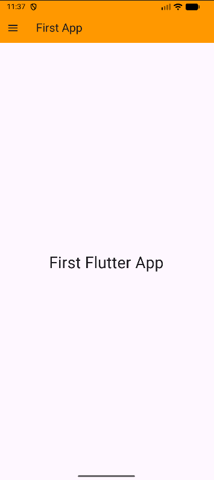
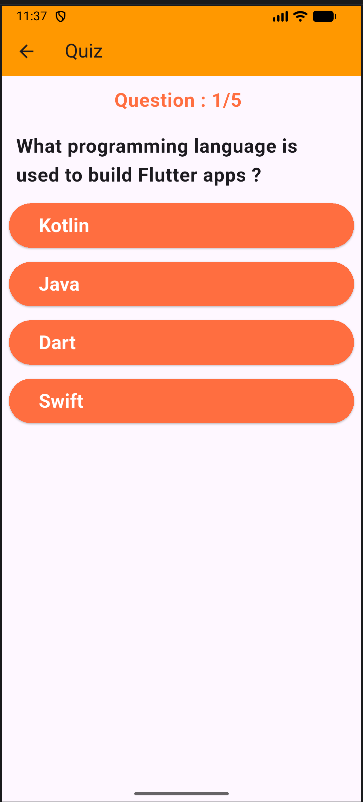
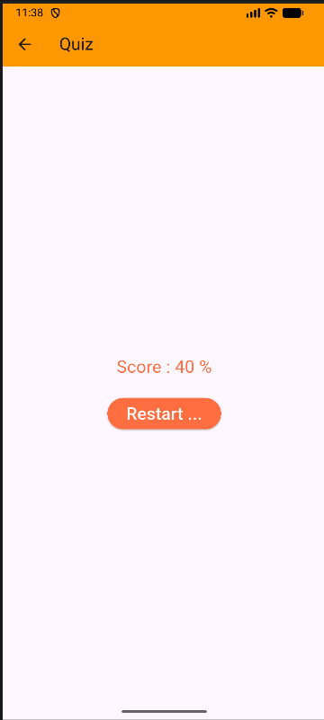
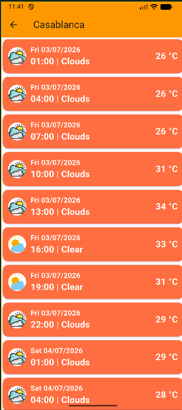
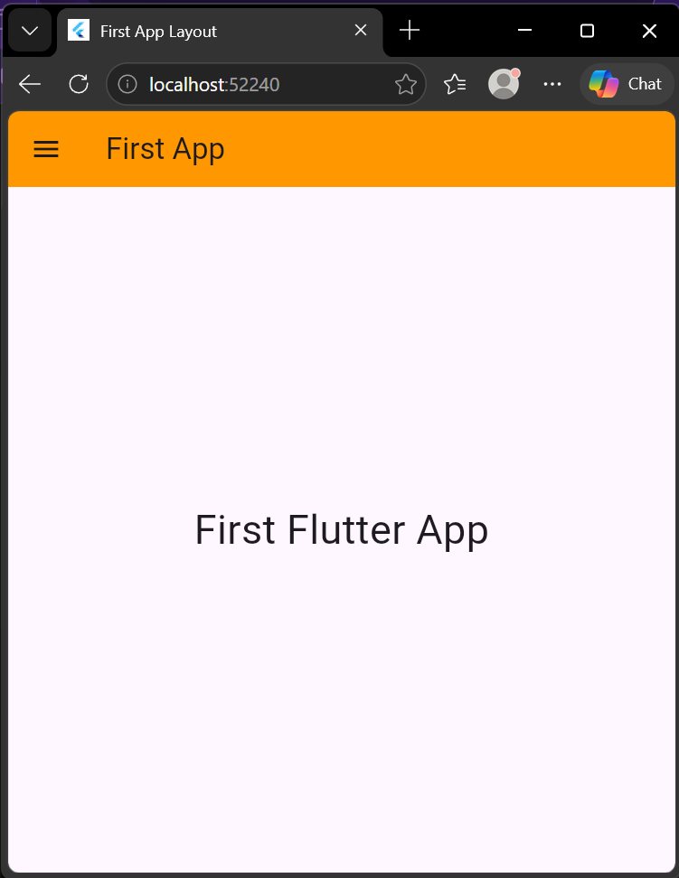
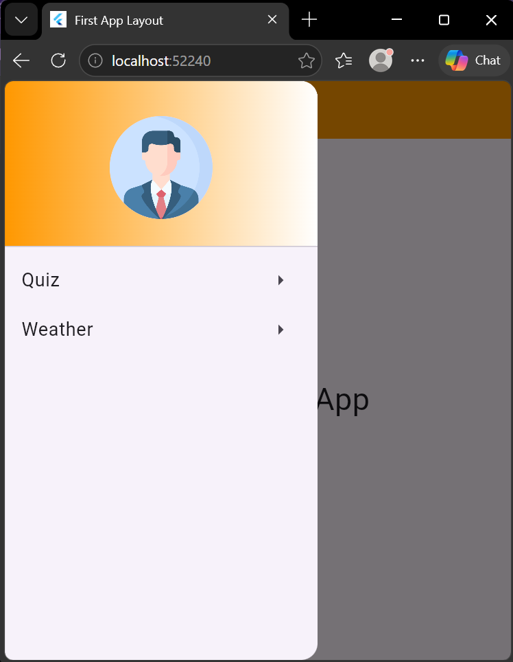
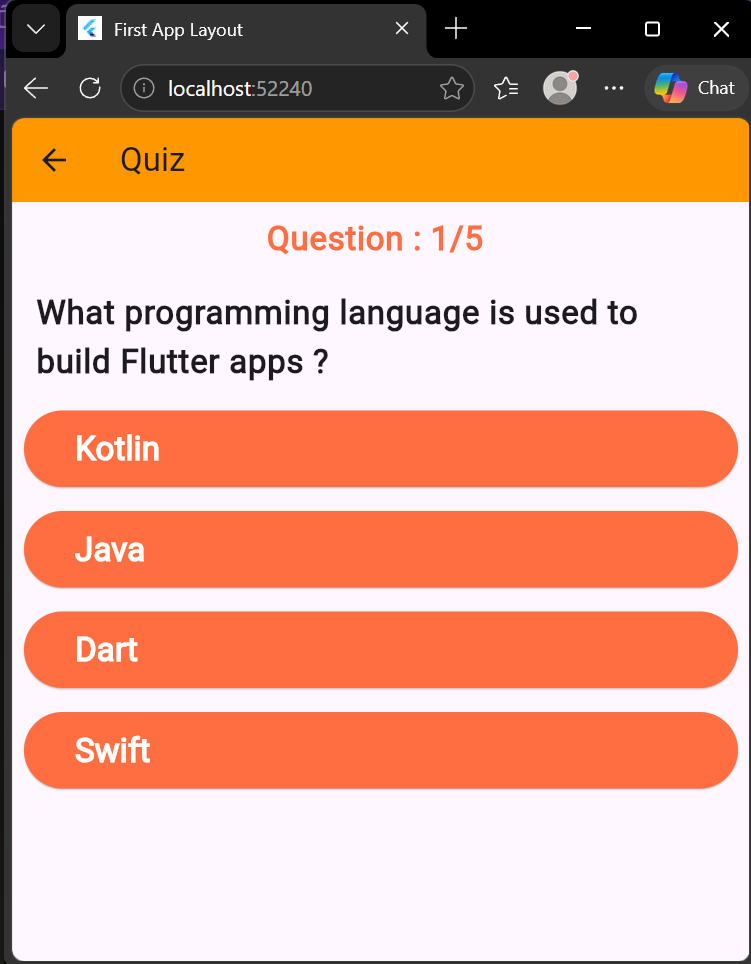
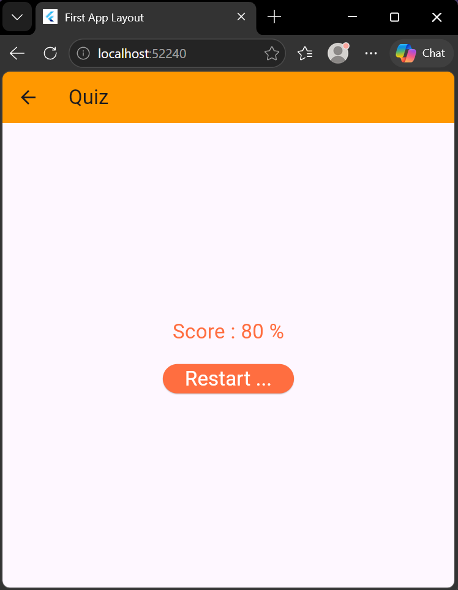
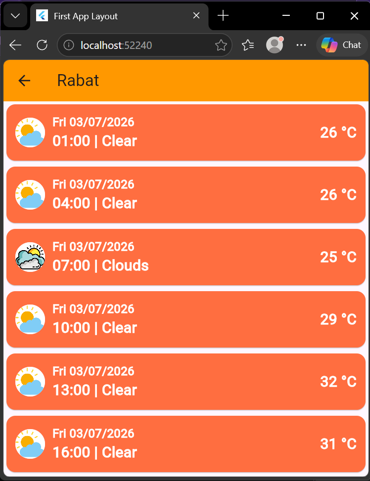

# Séance 3 : Flutter Partie 1

## Objectif
Reproduire et améliorer si besoin les dernières applications dont les codes sont exposés dans le support

## Structure
* `main.dart`: Drawer avec 2 elements `weather` et `quizz`
* `quizz.dart`: Gestion du quizz (question + reponse + score )
* `weather.dart`: Contact API du `OpenWeather` pour afficher les donnees de meteo
* `weather-form.dart`: Controle le formulaire de recherche pour meteo

## Screenshots
### Android Application
|Interface initial | Drawer | Quiz | Resultat | Weather|
|------------------|--------|------|----------|--------|
||||||


### Application Web
|Interface initial | Drawer | Quiz | Resultat | Weather|
|------------------|--------|------|----------|--------|
||||||


## Exécution
```bash
        cd quizz_app
        flutter run -d edge --dart-define-from-file=.env             # aperçu web
        flutter run -d <id-emulateur> --dart-define-from-file=.env   # sur émulateur/téléphone Android
```