# Séance 4 : Fultter Partie 2

Deux axes couverts par cette séance :
1. **Programmation orientée objet avec Dart** — classes, constructeurs, héritage, polymorphisme, gestion des erreurs, modèle géométrique complet.
2. **Application de synthèse Flutter** — navigation par Drawer, routes nommées, StatefulWidget / setState, navigation impérative (push / pop) avec passage de données, consommation d'API REST.

## Partie 1
Pratique des concept the base de programmation OO avec Dart
### Example 1

### Example 2

### Example 3


## Partie 2
### Version Web
|Home|Drawer|Meteo|Gallery|
|----|------|-----|--------|
|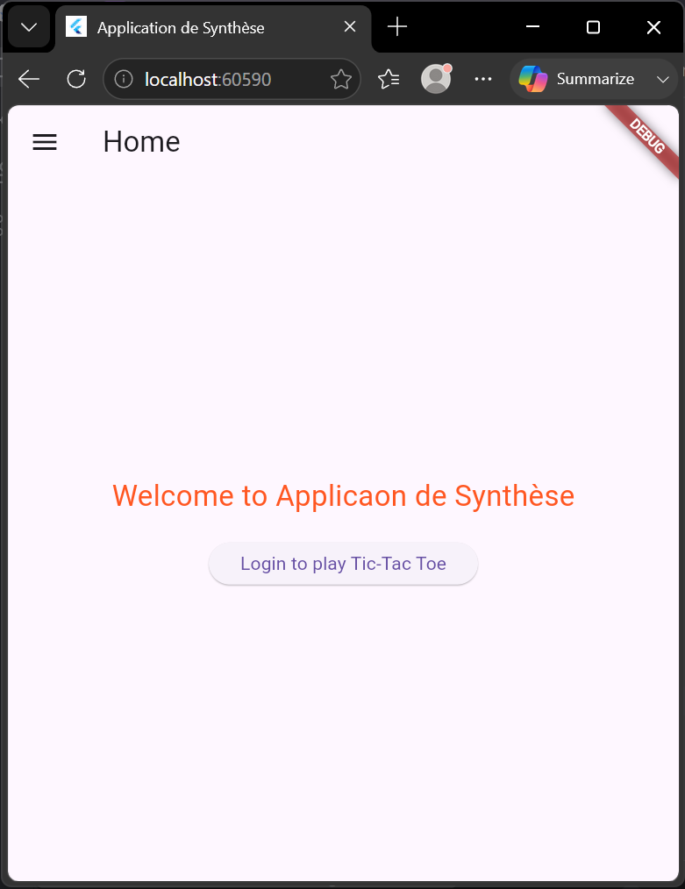|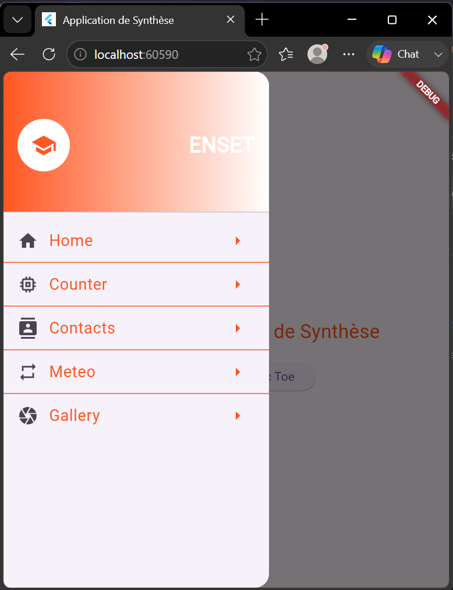|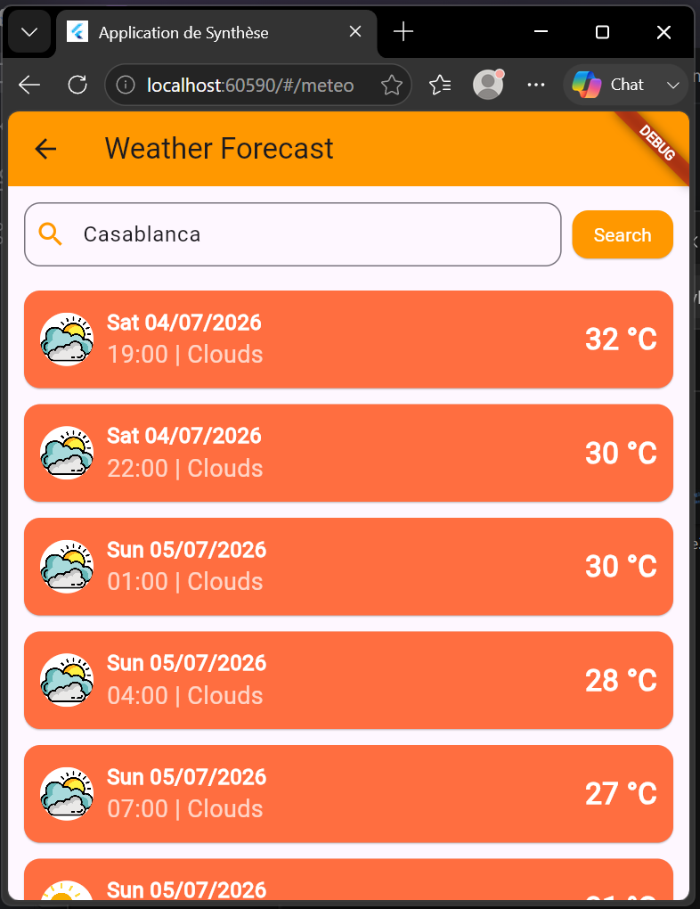||


|Counter|Contact|Login|
|------|--------|------|
|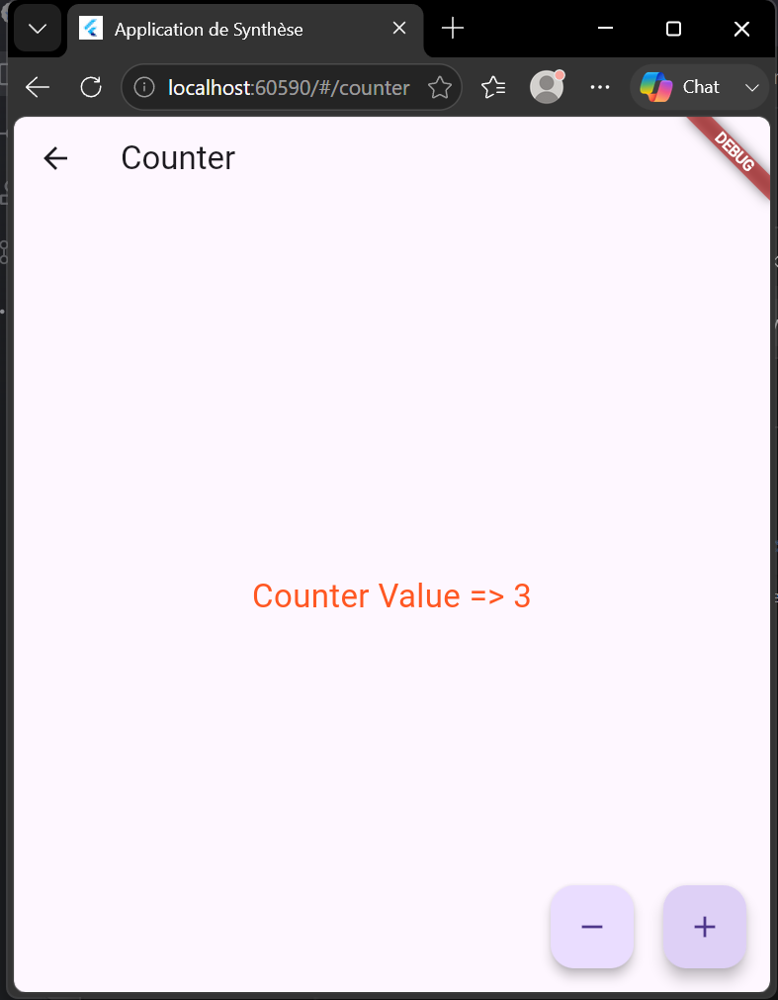|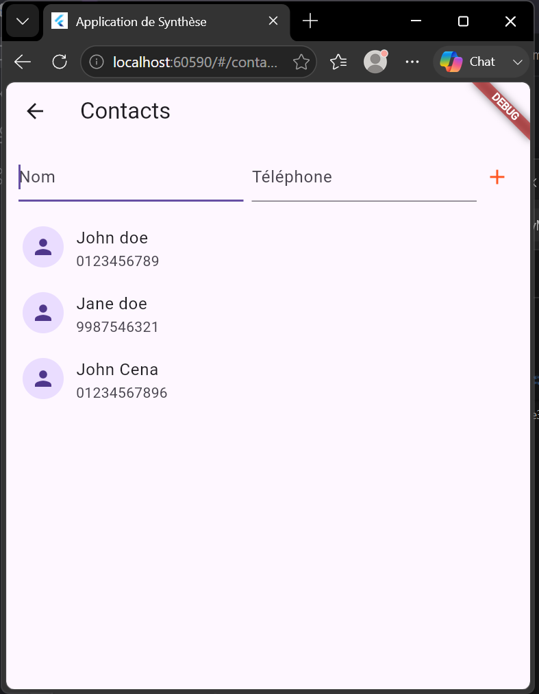|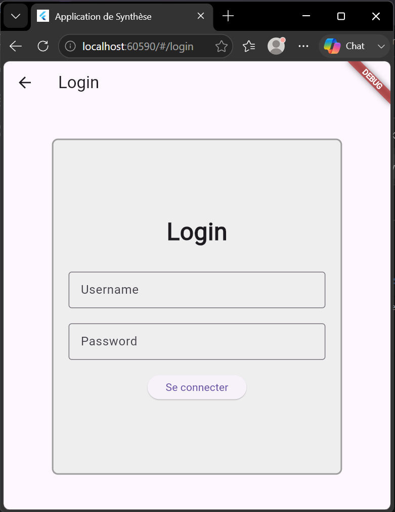|


|Game|X Win|O win|Draw|
|----|-----|-----|----|
|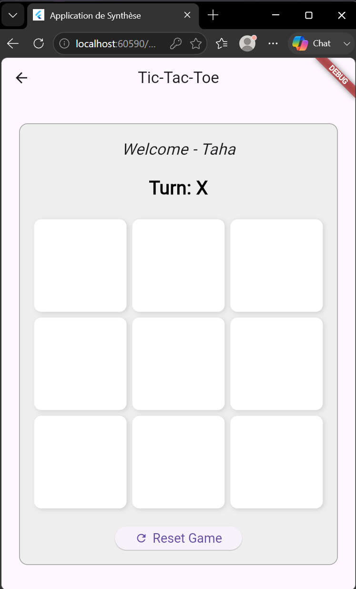|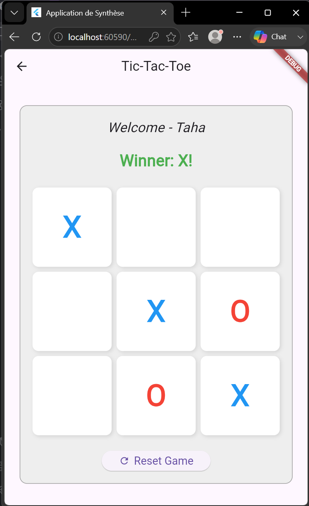|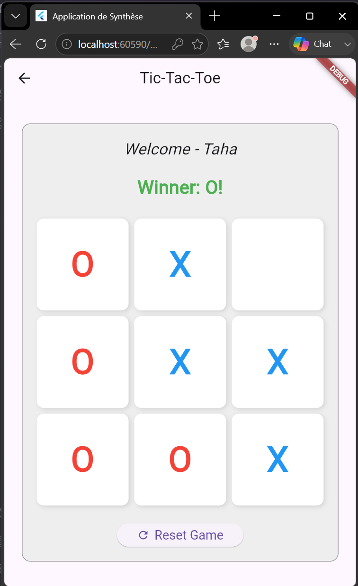|[Draw](./screenshots/Web_Draw.png)|


### Version Android
|Home|Drawer|Meteo|Gallery|
|----|------|-----|--------|
|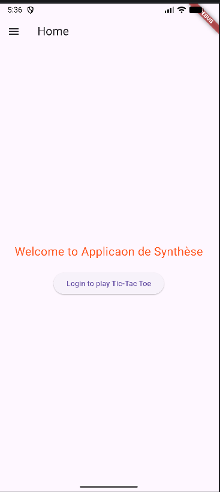|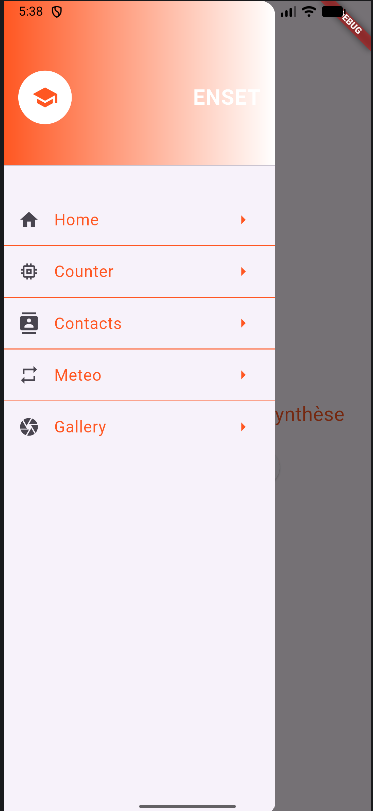|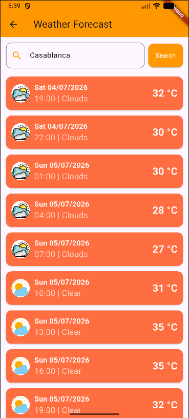|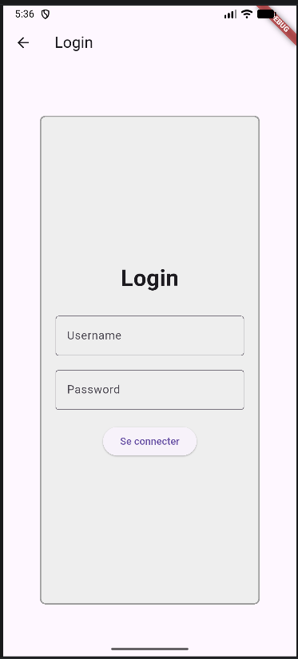|


|Counter|Contact|Login|
|------|--------|------|
|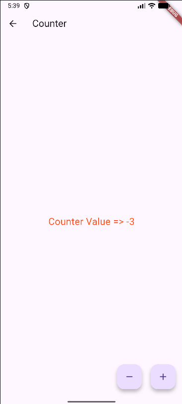|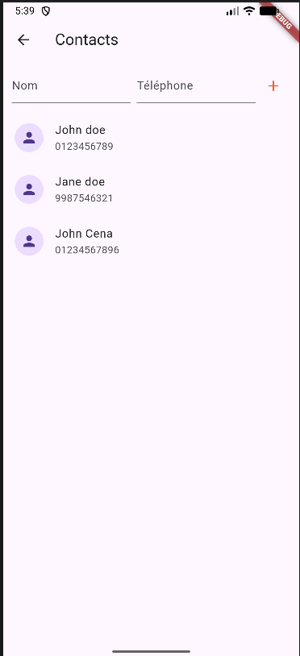||


|Game|X Win|O win|Draw|
|----|-----|-----|----|
|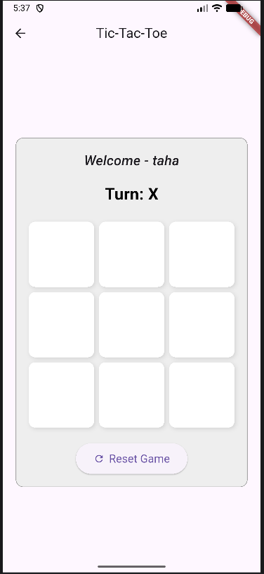|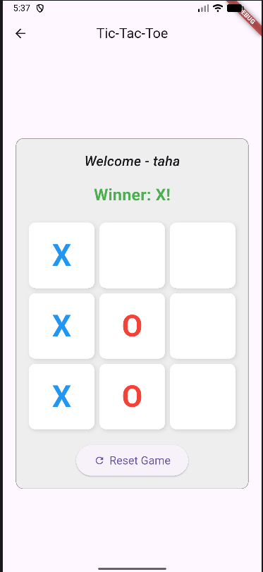|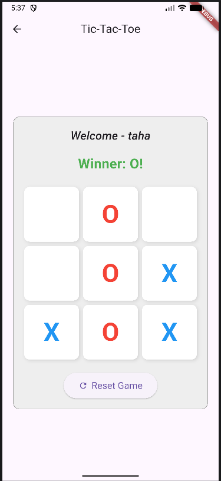|[Draw](./screenshots/Android_Draw.png)|


### Exécution
```bash
        cd app_synthese
        flutter run -d edge --dart-define-from-file=.env             # aperçu web
        flutter run -d <id-emulateur> --dart-define-from-file=.env   # sur émulateur/téléphone Android
```