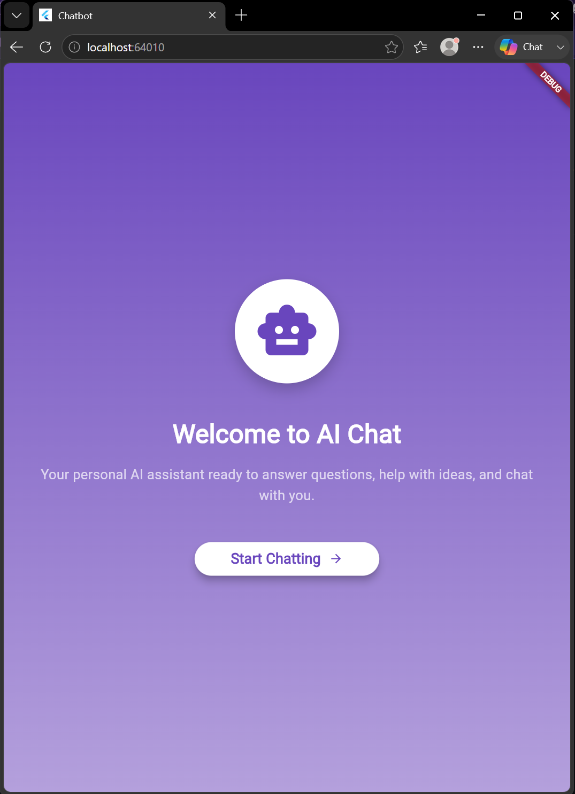
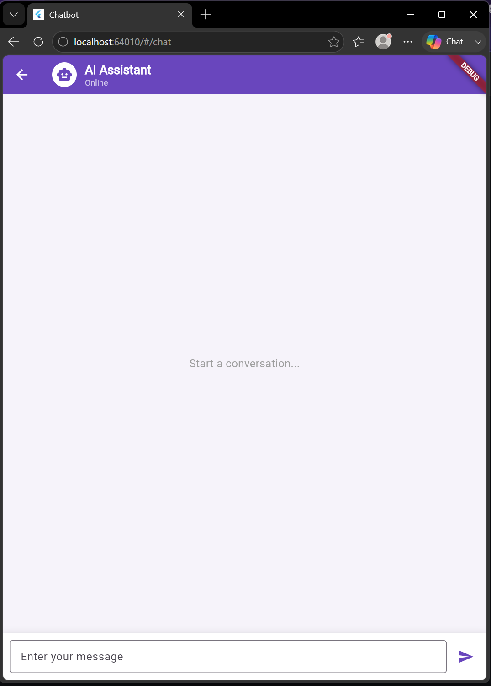
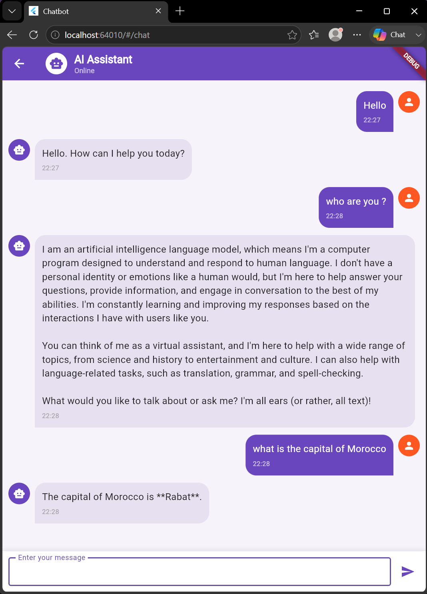
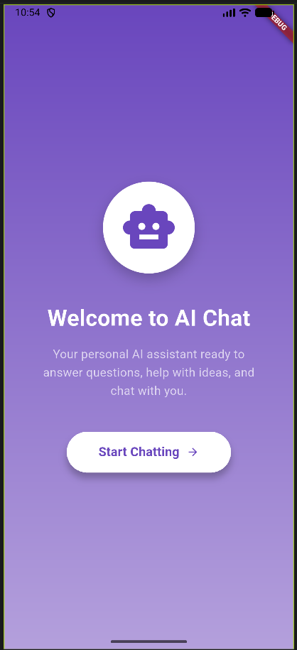
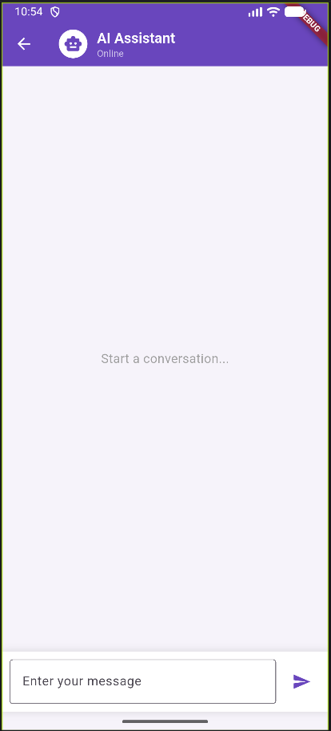
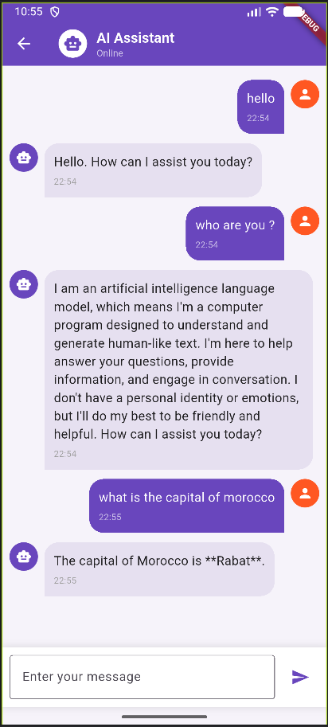

# Application Chatbot

Application multiplateforme (Android, iOS, web, Windows, macOS, Linux) simple type "ChatGPT" en Flutter, propulsée par l'API gratuite de Groq (modèles Llama).

## .env file
```bash
    API_KEY = -- Insert groq API key --
    ENDPOINT = "https://api.groq.com/openai/v1/chat/completions"
    MODEL = "llama-3.3-70b-versatile"
```

## Screenshots
### Version Web
|Home page|Interface| Messages|
|---------|---------|---------|
||||


### Version Android
|Home page|Interface| Messages|
|---------|---------|---------|
||||

## Notes
Application tester sur browser Edge et Firefox + Android
Vous pouvez creer une cle pour l'API a travers se lien https://console.groq.com/keys 