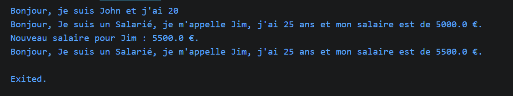
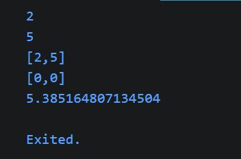
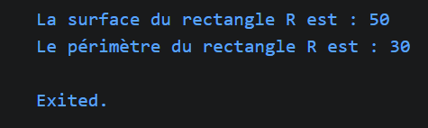

# Séance 4 : Fultter Partie 2

Deux axes couverts par cette séance :
1. **Programmation orientée objet avec Dart** — classes, constructeurs, héritage, polymorphisme, gestion des erreurs, modèle géométrique complet.
2. **Application de synthèse Flutter** — navigation par Drawer, routes nommées, StatefulWidget / setState, navigation impérative (push / pop) avec passage de données, consommation d'API REST.

## Partie 1
Pratique des concept the base de programmation OO avec Dart
### Example 1

### Example 2

### Example 3

## Partie 2