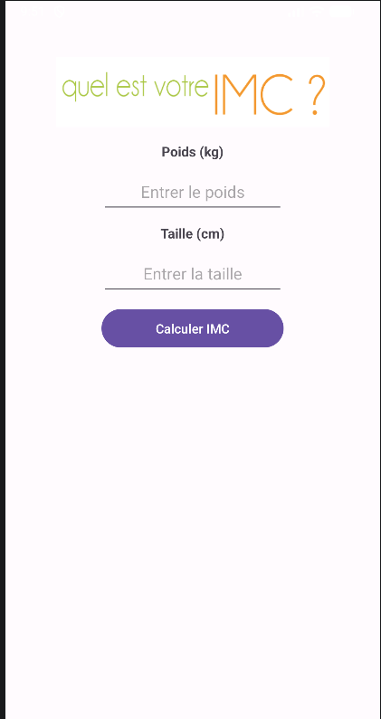
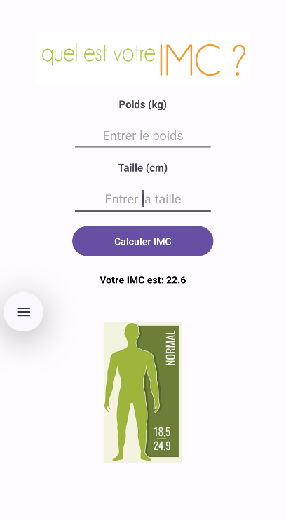
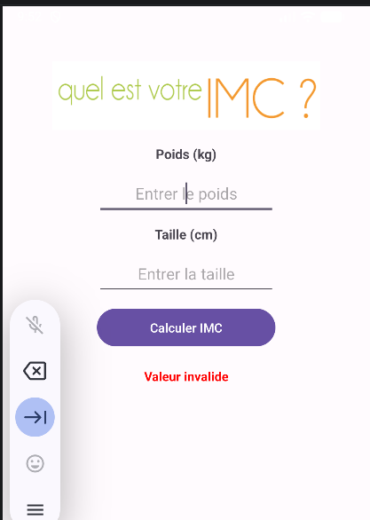

# TP Séance 1 - Application Mobile Calculateur de IMC

## Objectif
Familiarisation avec Kotlin et android studio

## Fonctionalite
* Fonction basic: le calcule de l'IMC avec presentation du resulta sous forme de valeur avec une illustration
* L'application ne se bloque pas dans le cas des inputs vide
* L'application n'accepte pas les valeurs negatifs et les valeurs illegaux textes
* Les labels ne sont pas hard-coded afin d'avoid la possibilite d'implementer une deuxieme languge

## Screenshots

### Interface

### Resultat avec des entres correctes

### Resultat avec des mauvais entres

