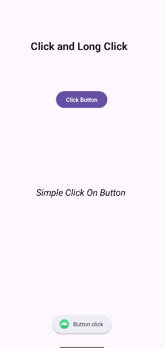
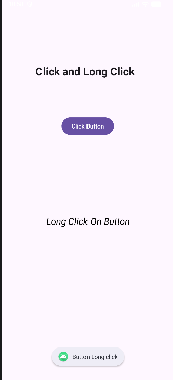
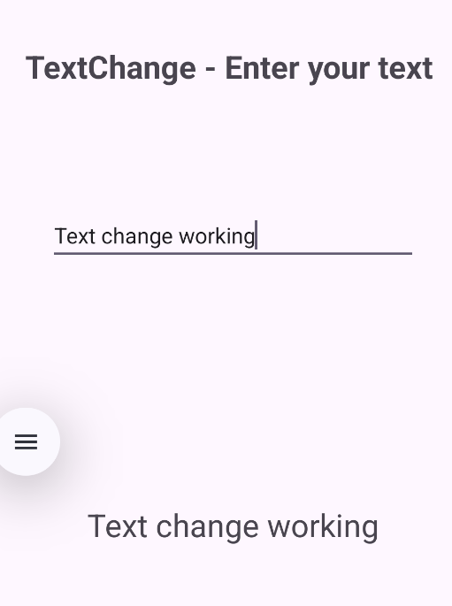
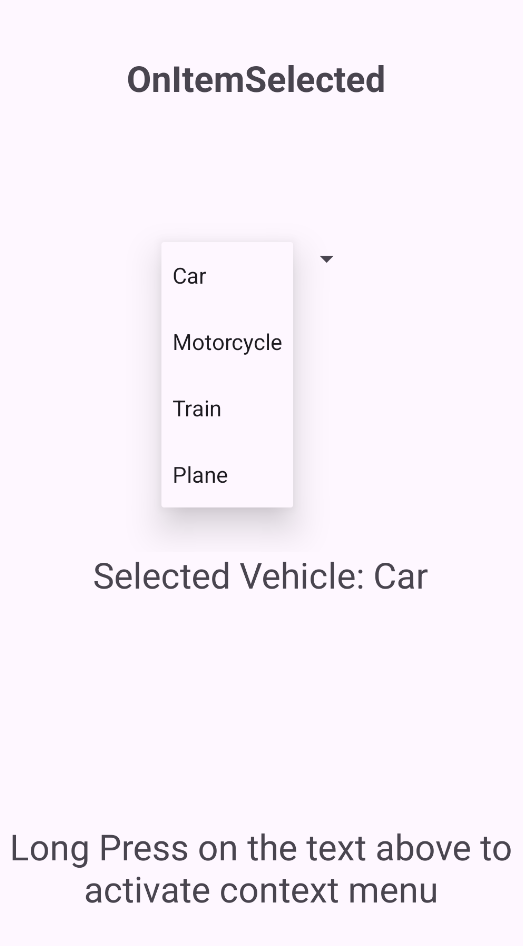
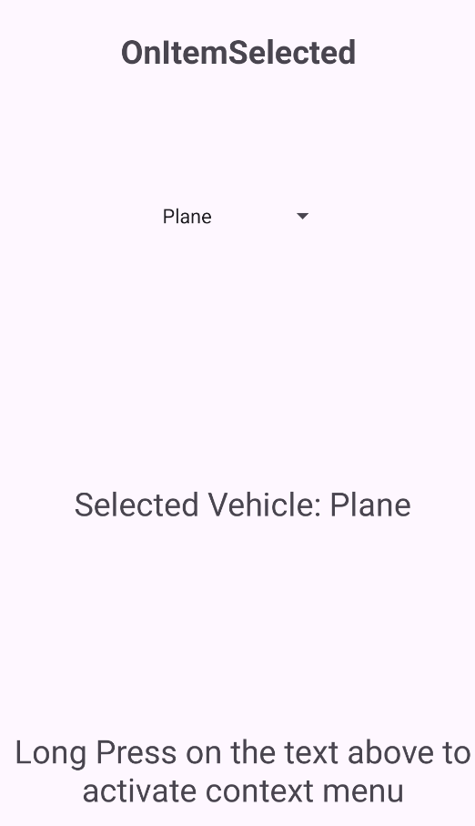
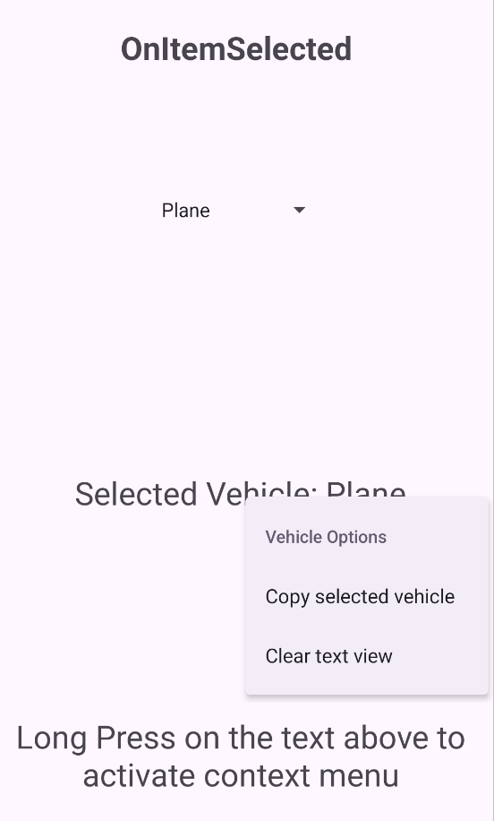
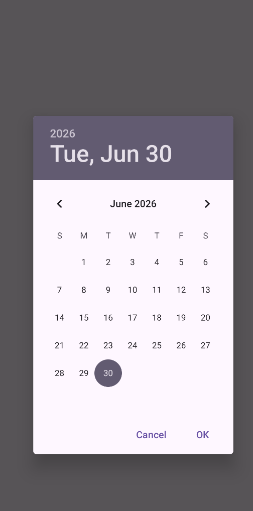
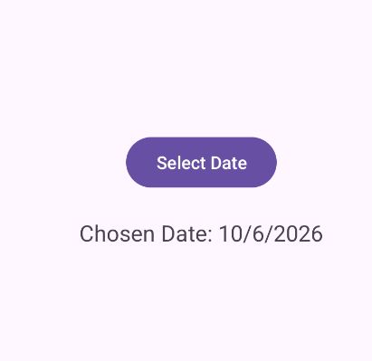

# Séance 2 : Jetpack compose & Kotlin Multplateforme
Ce dossier regroupe les travaux pratiques de la séance 2 du module Développement Mobile, portant sur les activités Android (cycle de vie, gestion des événements, navigation entre activités) et une introduction à Jetpack Compose.

## Activity 1
L'objectif de cette activité est de créer plusieurs interfaces graphiques et de gérer les évènements

### Click

### Long Click

### Swipe
Pour naviguer entre les differente activite utiliser `swipe left` `swipe right`

### TextChange

### OnITemSelected

### CreateContextMenu

### OndateSet

