# Séance 2 : Jetpack compose & Kotlin Multplateforme
Ce dossier regroupe les travaux pratiques de la séance 2 du module Développement Mobile, portant sur les activités Android (cycle de vie, gestion des événements, navigation entre activités) et une introduction à Jetpack Compose.

## Activity 1
L'objectif de cette activité est de créer plusieurs interfaces graphiques et de gérer les évènements

### Screenshots
| Click| Long Click | Swipe up | Swipe Down |
|------|------------|----------|------------|
|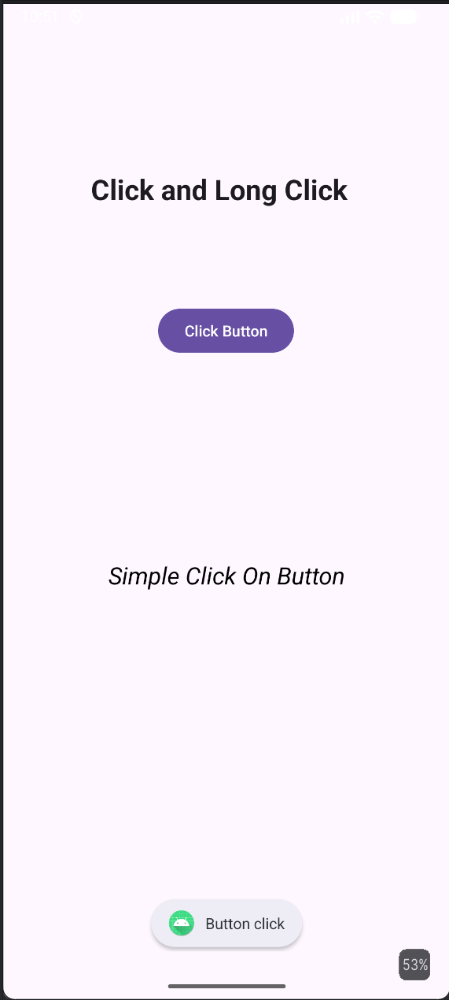|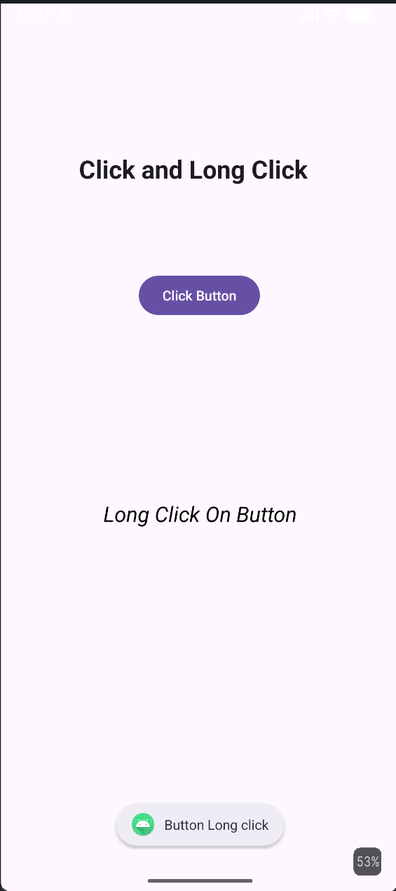 |  | |

| TextChange| Selection list | Item Selected |
|------------|---------------|-------------------|
|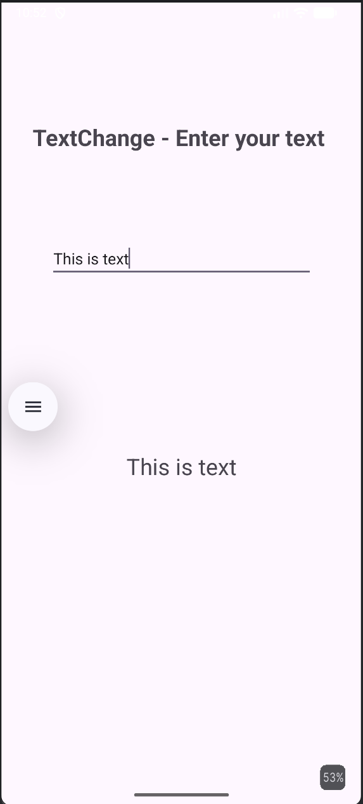|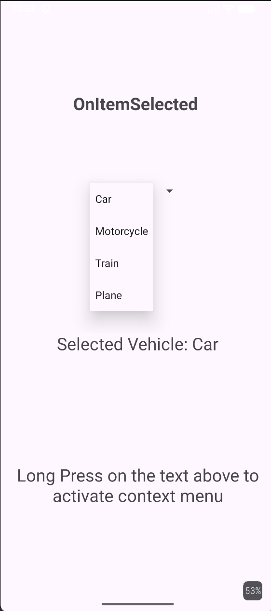|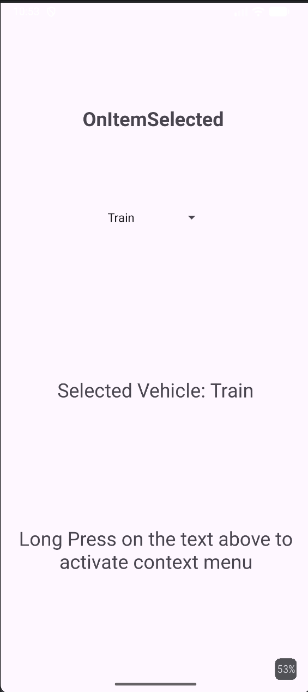|

| Context Menu| Launch Date selector | Date selector | Data Selection Result |
|-------------|------------|----------|------------|
|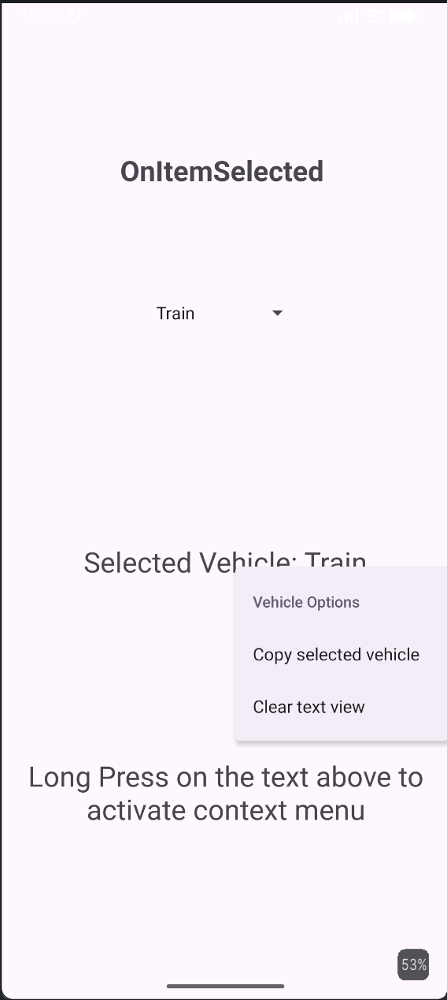 | |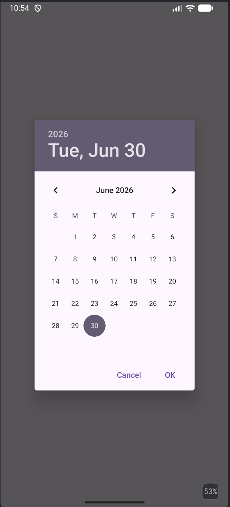||

## Activity 2
L'objectif de cette activité est de créer plusieur interface et utiliser `intent` afin de charge des nouvelles activites et pour passer des variable.

### Screenshots

|Splash Screen | Écran de connexion | Connexion remplie | Écran d'arrivée |
|--------------|--------------------|-------------------|-----------------|
|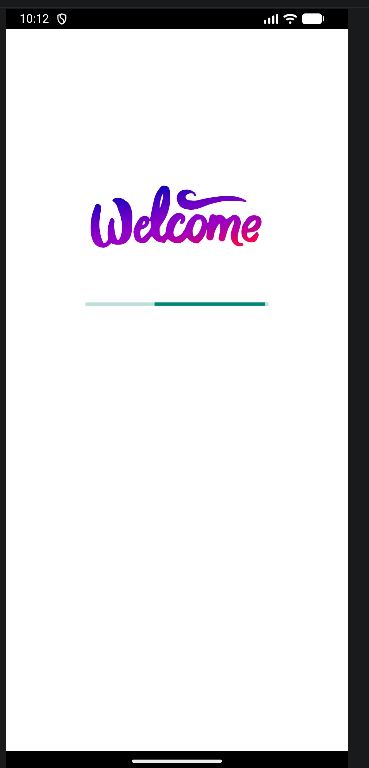|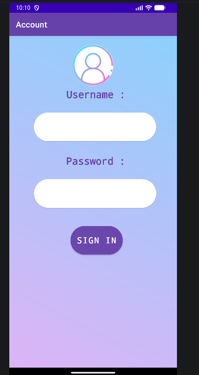|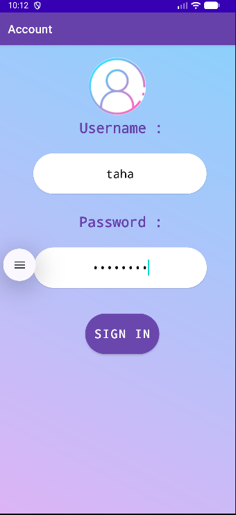|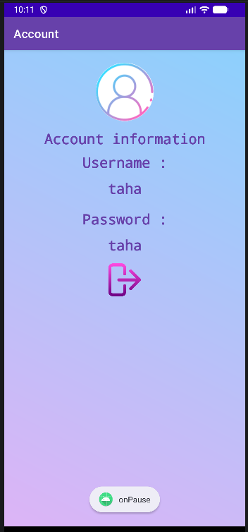|

|Erreur de connexion |
|--------------------|
|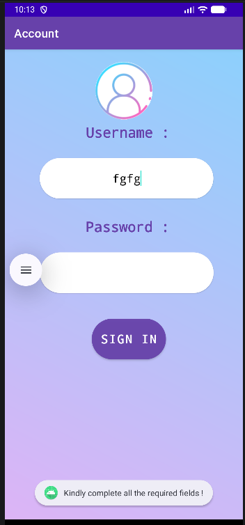|